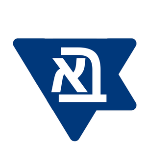

# 🌐 Кнопки для сайта - Deep Links для ботов

Этот файл содержит готовые решения для создания кнопок на вашем сайте, которые будут открывать мессенджеры и автоматически начинать диалог с ботом.

---

## 📱 1. TELEGRAM БОТ

### Имя бота
`@AlephBetForesightSummitbot`

### Deep Link (прямая ссылка)
```
https://t.me/AlephBetForesightSummitbot?start=register
```

### HTML кнопка для сайта
```html
<a href="https://t.me/AlephBetForesightSummitbot?start=register" 
   target="_blank" 
   class="btn btn-telegram">
   
   Регистрация через Telegram
</a>
```

### Пример CSS стилей
```css
.btn-telegram {
    display: inline-flex;
    align-items: center;
    gap: 10px;
    padding: 12px 24px;
    background: linear-gradient(135deg, #0088cc 0%, #229ED9 100%);
    color: white;
    text-decoration: none;
    border-radius: 8px;
    font-weight: 500;
    transition: all 0.3s ease;
    box-shadow: 0 4px 15px rgba(0, 136, 204, 0.3);
}

.btn-telegram:hover {
    transform: translateY(-2px);
    box-shadow: 0 6px 20px rgba(0, 136, 204, 0.4);
}
```

### QR-код
Вы можете создать QR-код для этой ссылки на сайте: https://www.qr-code-generator.com/

---

## 💬 2. WHATSAPP БОТ

### Номер бота
Укажите номер WhatsApp вашего бота в международном формате (без + и пробелов).  
Например: `972501234567` (Израиль) или `79123456789` (Россия)

### Deep Link (прямая ссылка)
```
https://wa.me/[ВАШ_НОМЕР]?text=START
```

Пример:
```
https://wa.me/972501234567?text=START
```

### HTML кнопка для сайта
```html
<a href="https://wa.me/[ВАШ_НОМЕР]?text=START" 
   target="_blank" 
   class="btn btn-whatsapp">
   
   Регистрация через WhatsApp
</a>
```

### Пример CSS стилей
```css
.btn-whatsapp {
    display: inline-flex;
    align-items: center;
    gap: 10px;
    padding: 12px 24px;
    background: linear-gradient(135deg, #25D366 0%, #128C7E 100%);
    color: white;
    text-decoration: none;
    border-radius: 8px;
    font-weight: 500;
    transition: all 0.3s ease;
    box-shadow: 0 4px 15px rgba(37, 211, 102, 0.3);
}

.btn-whatsapp:hover {
    transform: translateY(-2px);
    box-shadow: 0 6px 20px rgba(37, 211, 102, 0.4);
}
```

### QR-код
Создайте QR-код для вашей ссылки WhatsApp на: https://www.qr-code-generator.com/

---

## 📧 3. EMAIL БОТ

### Email адрес бота
Укажите email, который указан в переменной окружения `IMAP_USER`.  
Например: `summit@alef-bet.tech`

### Mailto Link (открывает почтовый клиент)
```
mailto:summit@alef-bet.tech?subject=Регистрация&body=START
```

### HTML кнопка для сайта
```html
<a href="mailto:summit@alef-bet.tech?subject=Регистрация&body=START" 
   class="btn btn-email">
   
   Регистрация через Email
</a>
```

### Пример CSS стилей
```css
.btn-email {
    display: inline-flex;
    align-items: center;
    gap: 10px;
    padding: 12px 24px;
    background: linear-gradient(135deg, #EA4335 0%, #D93025 100%);
    color: white;
    text-decoration: none;
    border-radius: 8px;
    font-weight: 500;
    transition: all 0.3s ease;
    box-shadow: 0 4px 15px rgba(234, 67, 53, 0.3);
}

.btn-email:hover {
    transform: translateY(-2px);
    box-shadow: 0 6px 20px rgba(234, 67, 53, 0.4);
}
```

---

## 🎨 Полный пример HTML страницы с кнопками

```html
<!DOCTYPE html>
<html lang="ru">
<head>
    <meta charset="UTF-8">
    <meta name="viewport" content="width=device-width, initial-scale=1.0">
    <title>Aleph Bet Foresight Summit - Регистрация</title>
    <style>
        * {
            margin: 0;
            padding: 0;
            box-sizing: border-box;
        }
        
        body {
            font-family: 'Segoe UI', Tahoma, Geneva, Verdana, sans-serif;
            background: linear-gradient(135deg, #667eea 0%, #764ba2 100%);
            min-height: 100vh;
            display: flex;
            justify-content: center;
            align-items: center;
            padding: 20px;
        }
        
        .container {
            background: white;
            padding: 40px;
            border-radius: 20px;
            box-shadow: 0 20px 60px rgba(0,0,0,0.3);
            max-width: 600px;
            text-align: center;
        }
        
        .logo {
            margin-bottom: 30px;
        }
        
        h1 {
            font-size: 28px;
            margin-bottom: 10px;
            color: #333;
        }
        
        .subtitle {
            font-size: 16px;
            color: #666;
            margin-bottom: 30px;
        }
        
        .buttons-container {
            display: flex;
            flex-direction: column;
            gap: 15px;
        }
        
        .btn {
            display: inline-flex;
            align-items: center;
            justify-content: center;
            gap: 12px;
            padding: 16px 32px;
            text-decoration: none;
            border-radius: 12px;
            font-weight: 500;
            font-size: 16px;
            transition: all 0.3s ease;
            color: white;
        }
        
        .btn-telegram {
            background: linear-gradient(135deg, #0088cc 0%, #229ED9 100%);
            box-shadow: 0 4px 15px rgba(0, 136, 204, 0.3);
        }
        
        .btn-telegram:hover {
            transform: translateY(-2px);
            box-shadow: 0 6px 20px rgba(0, 136, 204, 0.5);
        }
        
        .btn-whatsapp {
            background: linear-gradient(135deg, #25D366 0%, #128C7E 100%);
            box-shadow: 0 4px 15px rgba(37, 211, 102, 0.3);
        }
        
        .btn-whatsapp:hover {
            transform: translateY(-2px);
            box-shadow: 0 6px 20px rgba(37, 211, 102, 0.5);
        }
        
        .btn-email {
            background: linear-gradient(135deg, #EA4335 0%, #D93025 100%);
            box-shadow: 0 4px 15px rgba(234, 67, 53, 0.3);
        }
        
        .btn-email:hover {
            transform: translateY(-2px);
            box-shadow: 0 6px 20px rgba(234, 67, 53, 0.5);
        }
        
        .icon {
            width: 28px;
            height: 28px;
        }
        
        @media (max-width: 480px) {
            .container {
                padding: 30px 20px;
            }
            
            h1 {
                font-size: 24px;
            }
            
            .btn {
                padding: 14px 24px;
                font-size: 15px;
            }
        }
    </style>
</head>
<body>
    <div class="container">
        <div class="logo">
            
        </div>
        
        <h1>✡️ Aleph Bet Foresight Summit</h1>
        <p class="subtitle">Выберите удобный способ регистрации</p>
        
        <div class="buttons-container">
            <!-- Telegram Button -->
            <a href="https://t.me/AlephBetForesightSummitbot?start=register" 
               target="_blank" 
               class="btn btn-telegram">
                <svg class="icon" viewBox="0 0 24 24" fill="currentColor">
                    <path d="M12 0C5.373 0 0 5.373 0 12s5.373 12 12 12 12-5.373 12-12S18.627 0 12 0zm5.894 8.221l-1.97 9.28c-.145.658-.537.818-1.084.508l-3-2.21-1.446 1.394c-.14.18-.357.295-.6.295-.002 0-.003 0-.005 0l.213-3.054 5.56-5.022c.24-.213-.054-.334-.373-.121l-6.869 4.326-2.96-.924c-.64-.203-.658-.64.135-.954l11.566-4.458c.538-.196 1.006.128.832.941z"/>
                </svg>
                Регистрация через Telegram
            </a>
            
            <!-- WhatsApp Button -->
            <a href="https://wa.me/972501234567?text=START" 
               target="_blank" 
               class="btn btn-whatsapp">
                <svg class="icon" viewBox="0 0 24 24" fill="currentColor">
                    <path d="M17.472 14.382c-.297-.149-1.758-.867-2.03-.967-.273-.099-.471-.148-.67.15-.197.297-.767.966-.94 1.164-.173.199-.347.223-.644.075-.297-.15-1.255-.463-2.39-1.475-.883-.788-1.48-1.761-1.653-2.059-.173-.297-.018-.458.13-.606.134-.133.298-.347.446-.52.149-.174.198-.298.298-.497.099-.198.05-.371-.025-.52-.075-.149-.669-1.612-.916-2.207-.242-.579-.487-.5-.669-.51-.173-.008-.371-.01-.57-.01-.198 0-.52.074-.792.372-.272.297-1.04 1.016-1.04 2.479 0 1.462 1.065 2.875 1.213 3.074.149.198 2.096 3.2 5.077 4.487.709.306 1.262.489 1.694.625.712.227 1.36.195 1.871.118.571-.085 1.758-.719 2.006-1.413.248-.694.248-1.289.173-1.413-.074-.124-.272-.198-.57-.347m-5.421 7.403h-.004a9.87 9.87 0 01-5.031-1.378l-.361-.214-3.741.982.998-3.648-.235-.374a9.86 9.86 0 01-1.51-5.26c.001-5.45 4.436-9.884 9.888-9.884 2.64 0 5.122 1.03 6.988 2.898a9.825 9.825 0 012.893 6.994c-.003 5.45-4.437 9.884-9.885 9.884m8.413-18.297A11.815 11.815 0 0012.05 0C5.495 0 .16 5.335.157 11.892c0 2.096.547 4.142 1.588 5.945L.057 24l6.305-1.654a11.882 11.882 0 005.683 1.448h.005c6.554 0 11.89-5.335 11.893-11.893a11.821 11.821 0 00-3.48-8.413z"/>
                </svg>
                Регистрация через WhatsApp
            </a>
            
            <!-- Email Button -->
            <a href="mailto:summit@alef-bet.tech?subject=Регистрация&body=START" 
               class="btn btn-email">
                <svg class="icon" viewBox="0 0 24 24" fill="currentColor">
                    <path d="M20 4H4c-1.1 0-1.99.9-1.99 2L2 18c0 1.1.9 2 2 2h16c1.1 0 2-.9 2-2V6c0-1.1-.9-2-2-2zm0 4l-8 5-8-5V6l8 5 8-5v2z"/>
                </svg>
                Регистрация через Email
            </a>
        </div>
    </div>
</body>
</html>
```

---

## 🔧 Интеграция с Tilda, WordPress, Wix и другими конструкторами

### Tilda
1. Добавьте блок "HTML-код" (T123)
2. Вставьте код кнопок из примера выше
3. Опубликуйте страницу

### WordPress
1. Откройте редактор страницы/поста
2. Добавьте блок "Пользовательский HTML"
3. Вставьте код кнопок
4. Сохраните изменения

### Wix
1. Добавьте элемент "HTML iframe"
2. Вставьте код кнопок
3. Настройте размеры
4. Опубликуйте сайт

### Webflow
1. Добавьте элемент "Embed"
2. Вставьте код кнопок
3. Опубликуйте проект

---

## 📊 Отслеживание кликов (опционально)

Если вы хотите отслеживать, сколько людей нажимают на каждую кнопку:

### Google Analytics
```html
<a href="https://t.me/AlephBetForesightSummitbot?start=register" 
   target="_blank" 
   class="btn btn-telegram"
   onclick="gtag('event', 'click', {'event_category': 'Registration', 'event_label': 'Telegram'});">
   Регистрация через Telegram
</a>
```

### Facebook Pixel
```html
<a href="https://t.me/AlephBetForesightSummitbot?start=register" 
   target="_blank" 
   class="btn btn-telegram"
   onclick="fbq('track', 'InitiateCheckout', {content_name: 'Telegram Registration'});">
   Регистрация через Telegram
</a>
```

---

## ✅ Тестирование

После добавления кнопок на сайт, протестируйте их:

1. **Telegram**: Должен открыться чат с ботом и автоматически отправить /start
2. **WhatsApp**: Должен открыться чат с текстом "START" готовым к отправке
3. **Email**: Должен открыться почтовый клиент с темой "Регистрация" и телом "START"

---

## 🎯 Рекомендации

1. **Мобильная версия**: Убедитесь, что кнопки хорошо выглядят на мобильных устройствах
2. **Иконки**: Используйте SVG иконки для чёткости на всех экранах
3. **Порядок кнопок**: Расположите кнопки по популярности (обычно Telegram → WhatsApp → Email)
4. **Цвета**: Используйте фирменные цвета мессенджеров для узнаваемости
5. **Текст**: Сделайте текст кнопки понятным - "Регистрация через..."

---

## 📱 Дополнительно: QR-коды для офлайн-материалов

Создайте QR-коды для каждого бота и используйте их на:
- Печатных материалах
- Баннерах
- Визитках
- Презентациях

Генераторы QR-кодов:
- https://www.qr-code-generator.com/
- https://www.qrstuff.com/
- https://www.the-qrcode-generator.com/

---

**Готово! 🎉** Теперь пользователи смогут одним кликом начать регистрацию через любой удобный мессенджер!


